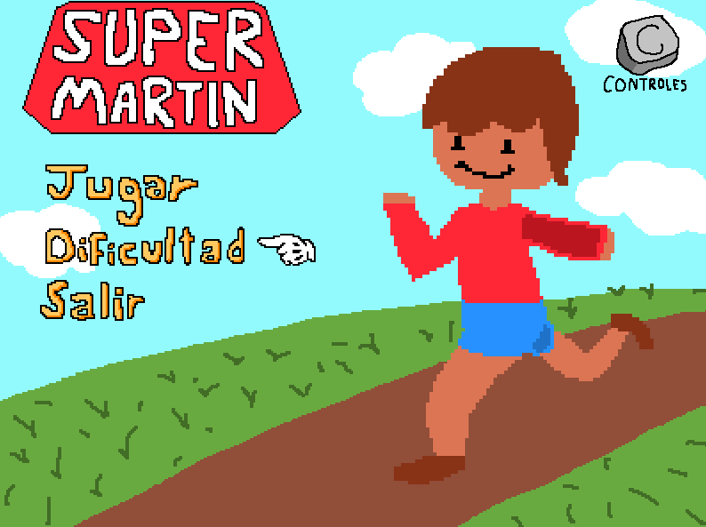
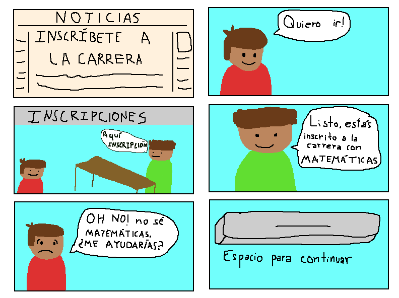
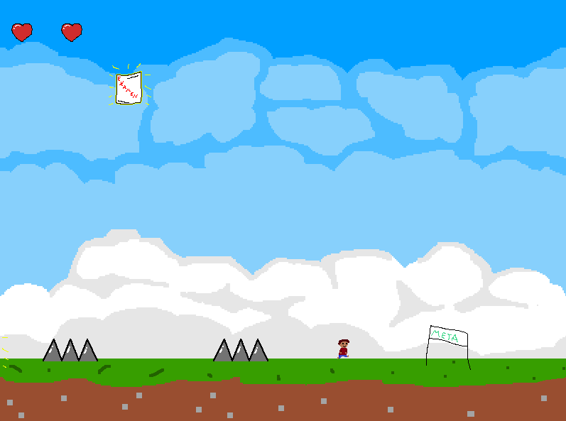
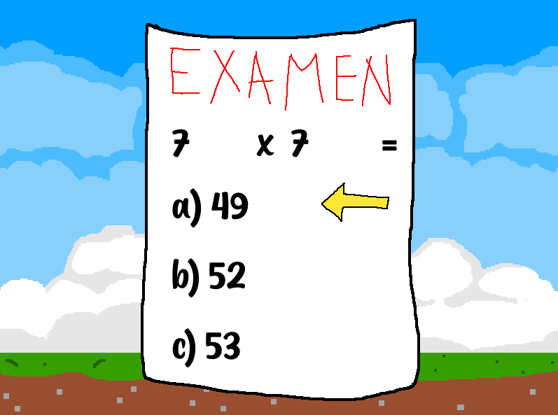
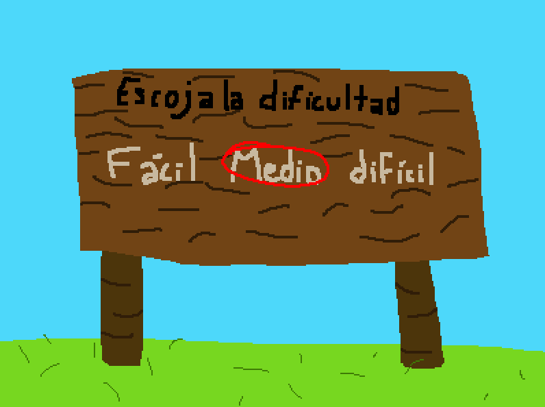
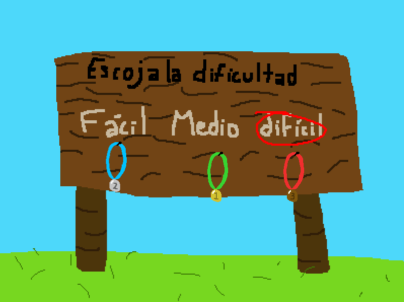

# Super Martin

## About the Project:
Super Martin is a 2D educational platformer videogame where you help a child who wants to compete in a racing tournament. However, there's a twist: it turns out to be a math race! He needs your help to solve arithmetic operations and finish every track in 1st place. Do you have what it takes to win?

This project was the final assignment for my 3rd semester at university and marks my first formally completed video game, co-developed with a friend. The main constraint was to build an educational game exclusively using the Allegro library. I learned a lot during the process and it was the first time I actually needed to dive into the official documentation of a software library. Looking back, it blows my mind how heavily commented the code is, especially considering I wrote it in a time with no AI.

## Key Features

- **Math-Based Gameplay:** Solve arithmetic problems to achieve a better result.
- **3 Difficulty Levels:** Easy, Normal and Hard modes that adjust the complexity of the operations.
- **Complete Original Art:** Full Original assets made with a pixel art tool called "Piskel".
- **Local Save System:** Trophies are saved automatically.

## How to Build & Run
1. Clone this repository.
2. Open 'SuperMartin.sln'
3. Restore **NuGet Packages** (Allegro 5) via the Solution Explorer.
4. Build and Run

## In-Game Screenshots
#### **The introduction comic**

#### **What a level looks like**

#### **In-game Math-Test**

#### **Difficulty and achievements system**

##### *Before completing levels:*

##### *After unlocking trophies:*

